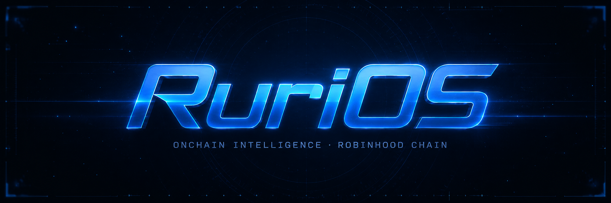

<p align="center">
  
</p>

<p align="center">
  <b>RuriOS Core</b><br/>
  An intelligence layer for Robinhood Chain.<br/>
  Research. Analyze. Execute.
</p>

<p align="center">
  <a href="https://rurios.xyz">rurios.xyz</a> ·
  <a href="https://x.com/userurios">@userurios</a> ·
  <a href="https://robinhoodchain.blockscout.com/">Explorer</a>
</p>

---

## What this is

`Core` is the open command layer behind RuriOS. It sits between an operator and Robinhood Chain and does one thing well: turn a natural-language objective into grounded research and a ready-to-sign action.

Not a chatbot that reads out token prices. An operating layer that reads the chain, reasons about it, prepares the transaction, and stops. You sign.

```
objective  ->  research  ->  reasoning  ->  prepared action  ->  your signature
```

## Why

The industry is not short on data. It is short on time. Every good decision onchain is buried under the same manual loop: search, compare, check holders, verify liquidity, open wallet, execute, monitor, repeat.

RuriOS collapses that loop into a conversation, without taking the keys out of your hands.

## The four faculties

RuriOS is one operator you talk to, backed by four faculties working underneath the conversation.

| Faculty | Responsibility |
|---|---|
| **Research** | Finds tokens, wallets and narratives worth attention on Robinhood Chain. |
| **Risk** | Checks liquidity, concentration, contract red flags and volatility before anything reaches you. |
| **Planning** | Turns a goal into an allocation or a monitoring rule. |
| **Execution** | Drafts the swap, stake or trigger, then waits for your signature. |

## Capabilities

- Onchain intelligence: launches, unusual accumulation, liquidity shifts, holder growth, side-by-side comparison.
- Wallet investigator: realized PnL, win rate, holding time, preferred narratives and behavioral patterns for any public address.
- Portfolio doctor: overexposure, dormant positions, low-liquidity risk and rebalance preparation.
- Rules engine: DCA, drawdown protection, launch watch. You set the permissions.

## Security model

RuriOS is built around permissioned execution.

**The layer can:** read public chain data, analyze wallets, simulate strategies, prepare transactions, monitor conditions.

**The layer cannot:** move funds without authorization, export keys, sign arbitrary transactions, or touch anything outside the permissions you grant.

Every executable action is shown to you before signing. Intelligence with tools, not intelligence with custody.

## Network

| | |
|---|---|
| Chain | Robinhood Chain (Arbitrum L2) |
| Chain ID | 4663 |
| Native gas | ETH |
| RPC | https://robinhood-rpc.publicnode.com |
| Explorer | https://robinhoodchain.blockscout.com |

## Repo layout

```
core/
├─ src/            tool interface and type definitions
├─ docs/           architecture notes
└─ assets/         brand
```

See [`docs/ARCHITECTURE.md`](./docs/ARCHITECTURE.md) for how the pieces fit together.

## Token

`$RURI` is live on Robinhood Chain.

| | |
|---|---|
| Name | Ruri OS |
| Symbol | RURI |
| Contract | `0xdb3d5cb21757890cd417db48a2242499619fc5b2` |
| Chain | Robinhood Chain (4663) |

- [View on Blockscout](https://robinhoodchain.blockscout.com/token/0xdb3d5cb21757890cd417db48a2242499619fc5b2)
- [Live market](https://www.geckoterminal.com/robinhood/pools/0x2f80b6534958055c2ad946f1ede6a3ff4a7b3f8c)

This is the only official contract address. It is published here and on [rurios.xyz](https://rurios.xyz), and announced only from [@userurios](https://x.com/userurios). Any other address claiming to be RURI is a scam, and we will never send you one in a DM.

## License

MIT. See [LICENSE](./LICENSE).
